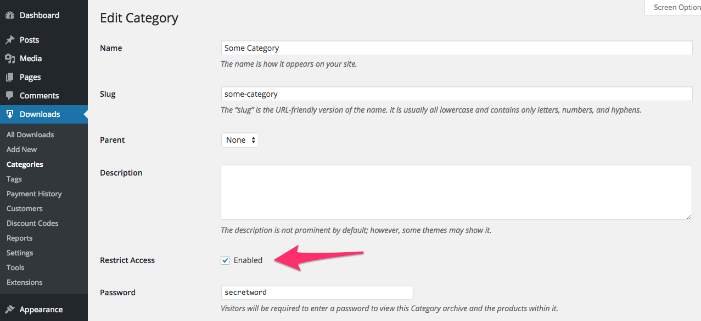
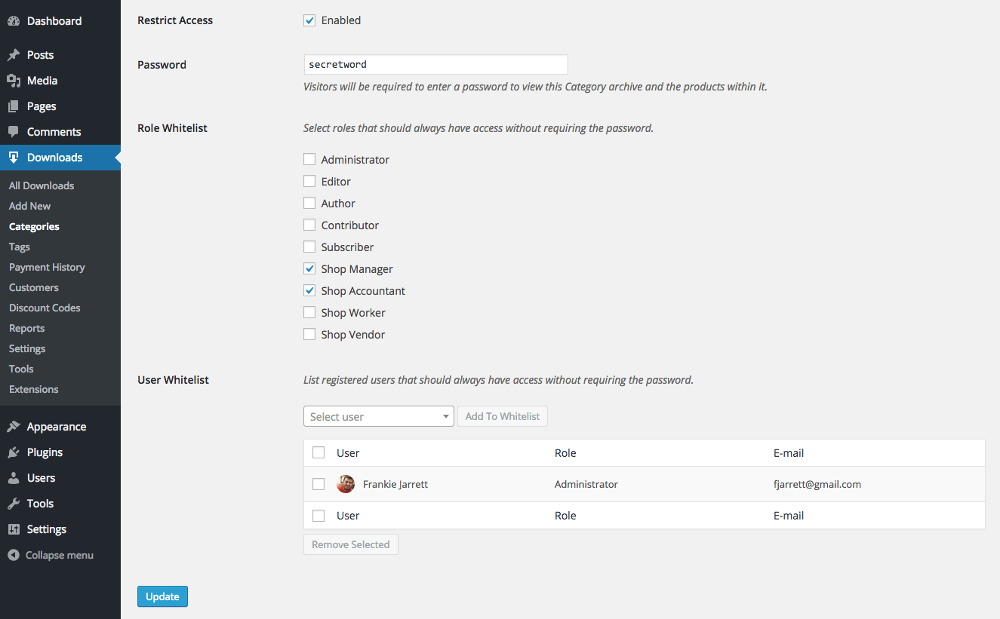

<!-- DO NOT EDIT THIS FILE; it is auto-generated from readme.txt -->
# EDD Restrict Categories

Password protect your digital download category archives and the products inside them.

**Contributors:** [fjarrett](https://profiles.wordpress.org/fjarrett)  
**Tags:** [ecommerce](https://wordpress.org/plugins/tags/ecommerce), [shop](https://wordpress.org/plugins/tags/shop), [shopping](https://wordpress.org/plugins/tags/shopping), [store](https://wordpress.org/plugins/tags/store), [edd](https://wordpress.org/plugins/tags/edd)  
**Requires at least:** 4.0  
**Tested up to:** 4.2  
**Stable tag:** 1.0.0  
**License:** [GPLv2](https://www.gnu.org/licenses/gpl-2.0.html)  
**EDD requires at least:** 2.3.9  
**EDD tested up to:** 2.3.9  

## Description ##

TODO

## Frequently Asked Questions ##

### Are products that belong to restricted categories also restricted? ###
Yes. By default, products that belong to restricted categories are also restricted when their URL is accessed directly by unauthenticated users.

However, this behavior can be overridden using the `eddrc_restrict_post` filter by adding this hook as an [MU plugin](https://codex.wordpress.org/Must_Use_Plugins) or to your theme's `functions.php` file:

```php
function my_custom_eddrc_restrict_post( $restrict_post, $post_id, $taxonomy, $term_id ) {
	return false; // URLs to all products belonging to restricted categories can be accessed directly
}
add_filter( 'eddrc_restrict_post', 'my_custom_eddrc_restrict_post', 10, 4 );
```

Optionally, you can also use the `$post_id`, `$taxonomy` and/or `$term_id` parameters for more granular control over which products should be restricted.

### Can I grant certain users access to restricted categories without requiring a password? ###
Yes! If there are special users or roles that you don't want to restrict, you can whitelist them easily when editing the category.

Whitelisting means that these users will always have access to the category without requiring a password.

### Does this plugin work on Download Tag archives too? ###
Yes. By default, the `download_category` and `download_tags` taxonomies will both have the option of being restricted.

However, you can add/remove supported taxonomies as you wish using the `eddrc_taxonomies` filter by adding this hook as an [MU plugin](https://codex.wordpress.org/Must_Use_Plugins) or to your theme's `functions.php` file:

```php
function my_custom_eddrc_taxonomies() {
	return array( 'download_category', 'download_tag', 'my_custom_taxonomy' );
}
add_filter( 'eddrc_taxonomies', 'my_custom_eddrc_taxonomies' );
```

### How long will access be granted to a restricted category? ###
After a user enters the password for a restricted category they will be granted access for **1 hour** via a session cookie.

After 1 hour their cookie will expire and they will be required to re-enter the password.

The only exception is that if you _change_ the password, access for any existing authenticated users will immediately expire and they will be required to enter the new password you have set.

The default cookie TTL (time to live) can be customized easily using the `eddrc_auth_cookie_ttl` filter by adding this hook as an [MU plugin](https://codex.wordpress.org/Must_Use_Plugins) or to your theme's `functions.php` file:

```php
function my_custom_eddrc_auth_cookie_ttl( $ttl, $taxonomy, $term_id ) {
	return DAY_IN_SECONDS; // Time in seconds
}
add_filter( 'eddrc_auth_cookie_ttl', 'my_custom_eddrc_auth_cookie_ttl', 10, 3 );
```

Optionally, you can also use the `$taxonomy` and/or `$term_id` parameters to set a taxonomy-specific or term-specific TTL (time to live).

See also [Easier Expression of Time Constants](https://codex.wordpress.org/Easier_Expression_of_Time_Constants) in the Codex.


## Screenshots ##

### Restrict access to categories with a single checkbox and password



### Whitelist roles and users to automatically grant them access without requiring a password



### Users are prompted to unlock restricted content before viewing


## Changelog ##

### 1.0.0 - June 15, 2015 ###
* Initial release

Props [fjarrett](https://github.com/fjarrett)


